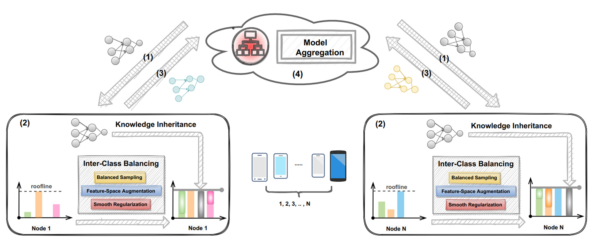
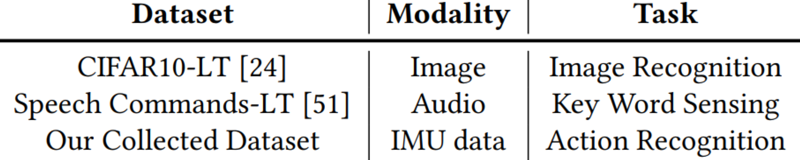

# BalanceFL
<p align="center" >
	
</p>

This is the repo for IPSN 2022 paper: "BalanceFL: Addressing Class Imbalance in Long-Tail Federated Learning".  

BalanceFL is a long-tailed federated learning framework
that can robustly learn both common and rare classes from a real-world dataset, simultaneously addressing the global and local data imbalance problems. 

It mainly includes two techniques: knowledge inheritance and inter-class balancing. Please refer to our paper for more details. 

<br>

# Requirements
The program has been tested in the following environment: 

* Python 3.7.11
* Pytorch 1.8.1
* torchvision 0.9.1
* torchaudio 0.8.1
* numpy 1.21.2
* librosa 0.6.0
* PyYAML 5.4.1
* Pillow 8.3.2
* h5py 3.4.0

<br>

# Project Structure
## Datasets
In Total, the evaluation involves three datasets. Each folder contains the code of one dataset.   
CIFAR10 and Speech Command are public datasets, while our collected IMU dataset is available in `./dataset/IMU/`.

<p align="center" >
	
</p>

## BalanceFL and and six baselines
quick start: run `python3 XXX.py`
* `train_ours.py`: ours  
* `train_central_bal.py`: centralized training with balanced softmax  
* `train_central.py`: naive centralized training  
* `train_fedavg.py`: fedavg  
* `train_fedprox.py`: fedprox  
* `train_local.py`: local training  
* `train_per.py`: Per-FedAvg    

<br>

# Citation
The dataset included in this repository is for non-commericial use. Please cite our work if you feel our work is helpful or use our collected IMU dataset:
```
Xian Shuai, Yulin Shen, Siyang Jiang, Zhihe Zhao, Zhenyu Yan, and Guoliang Xing. 2021. Balancefl: Addressing class imbalance in long-tail federated learning. In Proceedings of the International Conference on Information Processing in Sensor Networks (IPSN ’22), Milan, Italy.
```


